---
title:
author:
date:
output:
  revealjs::revealjs_presentation:
    css: style.css
    incremental: false
    theme: night
    highlight: tango
    transition: none
    center: true
---

# {data-background-color="#0a4f58"}

<h2 style="color: #de3c26;">
Canadian Aquatic Barriers Database
</h2>

<h3>
Supporting fish passage and connectivity conservation in Canada
</h3>

<h5>
Nick Mazany-Wright
</h5>

<h5>
August 23, 2022
</h5>

&nbsp;
&nbsp;
&nbsp;
&nbsp;

<div class="container">
<div class="col">
``` {r, echo=FALSE, out.width="50%", fig.align="left"}


#AWC3

```
</div>

<div class="col" style="justify-self: end; align-content: end;">
<span style="font-family: Bebas Neue;">Nova Scotia Partner Engagement Symposium</span>
</div>

</div>

# Canadian Aquatic Barriers Database (CABD)

## What is the conservation issue?

What we know:

- Structures like dams, culverts, and dykes block the movement of fish (and other species) and energy/matter
- Barriers to connectivity are extensive across Canada
- Barriers removal needed to restore access to important habitat and ecosystem functions
- Restoration projects are expensive

<center>
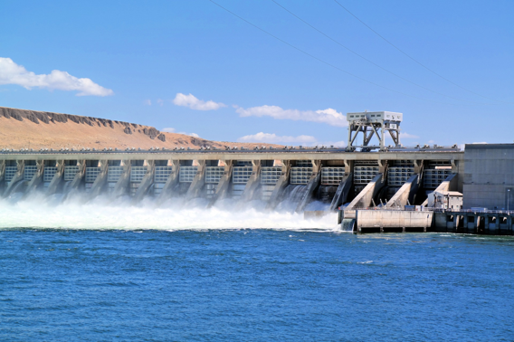{height=200px} {height=200px} 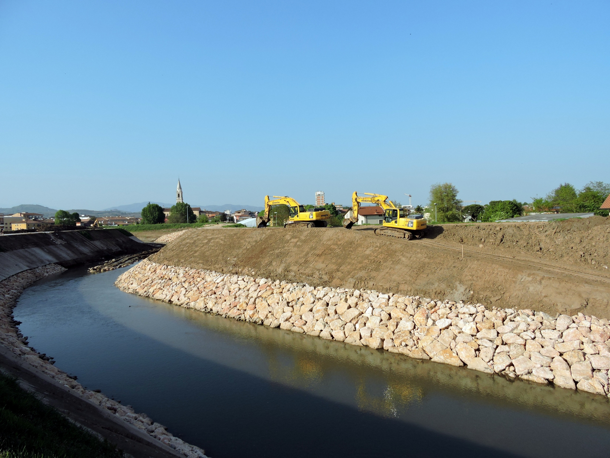{height=200px}
</center>

## What is the conservation issue?

What we don't know:

- How many barriers exist in Canada?
- How much habitat is not accessible?
- How do we identify the most important barriers to maximize benefits?

**<span style="color: #de3c26;">We need comprehensive information to answer these questions</span>**

## Canadian Aquatic Barriers Database (CABD)

<center>
**<span style="color: #de3c26;">Vision:</span>**
</center>

<center>
All Canada's barrier and connectivity information in one place -- easily and openly accessible!
</center>

## Project Background

- CABD = central pillar of tools to support CWF's fish passage program
- Identify and prioritize barriers for restoration
- Inspired work of TNC, NCC, and regional/local groups (e.g., NS Adopt a Stream)

<center>
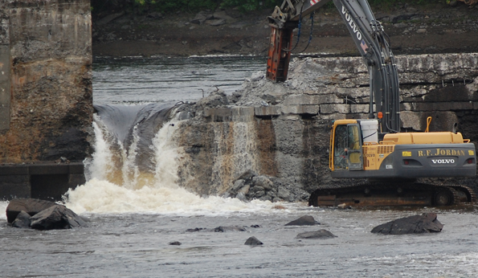
</center>

## Stakeholder Engagement

- User interviews
  + What type of work could the CABD support?
  + What information would be useful?
  + How would users like to access the data?
- Working Group and Technical Advisory Committee

&nbsp;

<center>
{height=50px} {height=50px} 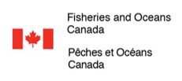{height=50px} 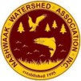{height=50px} {height=50px}
</center>

<center>
{height=25px} {height=50px} {height=25px}
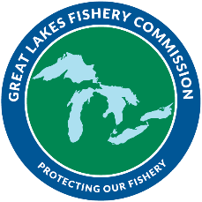{height=50px} {height=50px}
</center>

<center>
{height=50px} {height=50px} 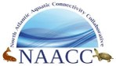{height=50px}
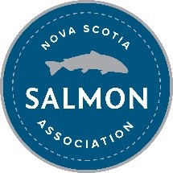{height=50px}
{height=50px}
</center>

## Data Gathering and Sharing

- CABD relies on existing repositories
  + Local in scale
  + Single barrier types
  + No standardization
- CWF offers national coordination **<span style="color: #de3c26;">without</span>** duplicating effort
- Establish **<span style="color: #de3c26;">reciprocal</span>** relationships
  + Share data back to providers

&nbsp;

<center>
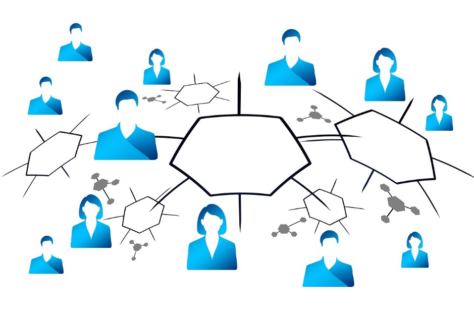{height=200px} 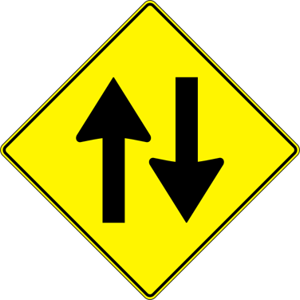{height=200px}
</center>

## What can the CABD be used for?

1. Habitat status assessments and reporting (watershed &rarr; national scales)
2. Informing management and regulatory decisions
3. Restoration planning and prioritization
4. Research and monitoring
5. Education and public outreach

## CABD Components

<div class="container">
<div class="col">
1. Hydrographic networks

<center>
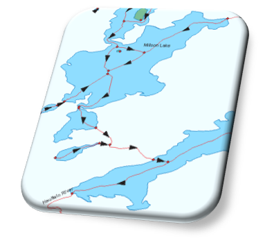{height=150px}
</center>
</div>

<div class="col">
2. Barrier data

<center>
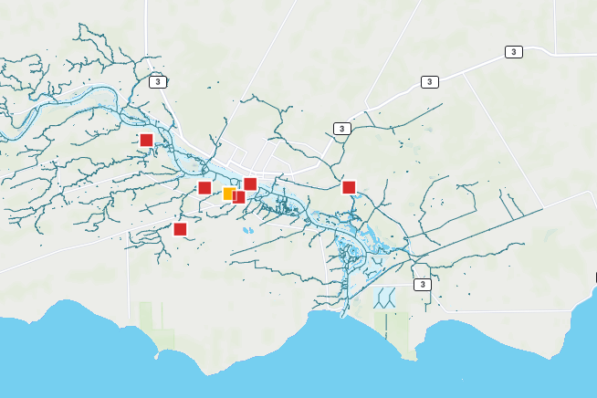{height=150px}
</center>
</div>

<div class="col">
3. Web map and tools

<center>
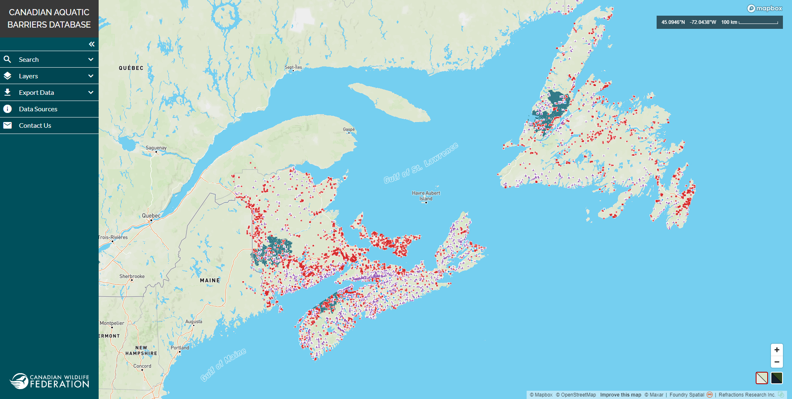{height=150px}
</center>
</div>

</div>

## Barrier Data

<div class="container">
<div class="col">
- Standardized data structure through engagement
- Current barrier types:
  + Dams (includes some weirs and dykes for now)
  + Waterfalls
  + Fishways (inherited CANFISHPASS from the Cooke lab at Carleton University)
- Future years:
  + **<span style="color: #de3c26;">Stream crossings (road, rail, trail)</span>**
  + Lateral barriers (dykes/levees, embankments, etc.)
  + Others?
</div>

<div class="col">
<center>

&nbsp;


</center>
</div>

</div>

## Barrier Data Processing

<div class="container">
<div class="col">
Five main steps:

1. Data source compilation
2. De-duplication
3. Spatial attribute mapping
4. Geolocation (including snapping to hydro network)
5. Non-spatial information collection
</div>

<div class="col">
<center>
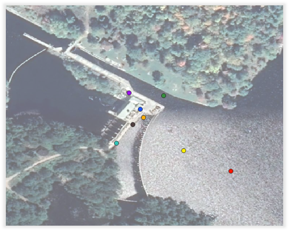
</center>
</div>

</div>

## Attribute mapping

1. Aggregate attributes from existing spatial sources
2. Identification of non-spatial data sources (search engines)

<center>
**<span style="color: #de3c26;">100+ data sources reviewed to date</span>**
</center>

&nbsp;

<center>
{height=300px} {height=300px}
</center>

## CABD v1.0

Complete national coverage was completed July 2022

&nbsp;

<span style = "font-size: 175%; font-family: Bebas Neue; padding-left: 105px;">Dams</span> <span style = "font-size: 175%; font-family: Bebas Neue; padding-left: 155px;">Waterfalls</span> <span style = "font-size: 175%; font-family: Bebas Neue; padding-left:125px;">Fishways</span>

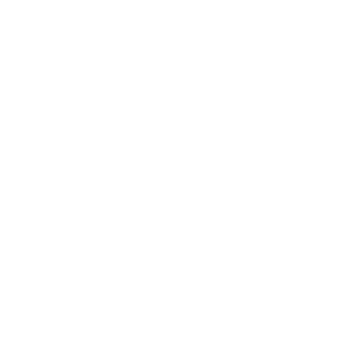{height=300px} 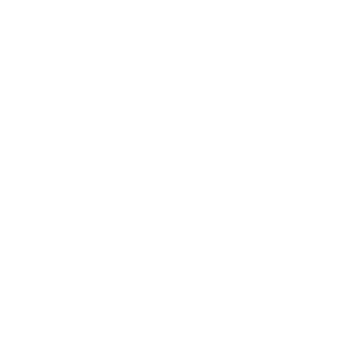{height=300px} 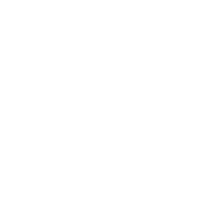{height=300} 

<span style = "font-size: 150%; font-family: Bebas Neue; color: #de3c26; padding-left: 95px;">36,799</span> <span style = "font-size: 150%; font-family: Bebas Neue; color: #de3c26; padding-left: 200px;">22,194</span> <span style = "font-size: 150%; font-family: Bebas Neue; color: #de3c26; padding-left:250px;">408</span>

## CABD v1.0

Are the CABD v1.0 datasets perfect? **<span style="color: #de3c26;">No!</span>**

Phase 1 = compile, deduplicate, and standardize existing datasets

Phase 2 = fill data gaps

- Data gaps exist (structures and attributes)
- But, most comprehensive and standardized datasets available nationally
- CWF, partners, and practitioners across the country can help contribute data and updates

## Demo!

<center>
<a href="https://cabd-k37sjncl0-foundryspatial.vercel.app/" data-preview-link>aquaticbarriers.ca</a>
</center>

<center>
<a href="https://cabd-docs.netlify.app/index.html" data-preview-link>CABD Documentation Site</a>
</center>

## Nova Scotia

&nbsp;

<span style = "font-size: 175%; font-family: Bebas Neue; padding-left: 105px;">Dams</span> <span style = "font-size: 175%; font-family: Bebas Neue; padding-left: 155px;">Waterfalls</span> <span style = "font-size: 175%; font-family: Bebas Neue; padding-left:125px;">Fishways</span>

{height=300px} {height=300px} {height=300} 

<span style = "font-size: 150%; font-family: Bebas Neue; color: #de3c26; padding-left: 105px;">1,362</span> <span style = "font-size: 150%; font-family: Bebas Neue; color: #de3c26; padding-left: 240px;">938</span> <span style = "font-size: 150%; font-family: Bebas Neue; color: #de3c26; padding-left:258px;">157</span>

## Dams in Nova Scotia


<center>
```{r api_call, message = FALSE, echo=FALSE}

library(httr)
library(mapview)
library(jsonlite)
library(geojsonsf)
library(dplyr)
library(ggplot2)
library(gridExtra)

cabd_test = GET("https://cabd-web.azurewebsites.net/cabd-api/features/dams?filter=province_territory_code:eq:ns&attributes=limited")
cabd_test = content(cabd_test,"text")

ns_dams = geojson_sf(cabd_test)

fishways = GET("https://cabd-web.azurewebsites.net/cabd-api/features/fishways?filter=province_territory_code:eq:ns&attributes=limited")
fishways = content(fishways,"text")

ns_fishways = geojson_sf(fishways)

waterfalls = GET("https://cabd-web.azurewebsites.net/cabd-api/features/waterfalls?filter=province_territory_code:eq:ns&attributes=limited")
waterfalls = content(waterfalls,"text")

ns_waterfalls = geojson_sf(waterfalls)

# ns_dams = fromJSON(cabd_test) %>% as.data.frame()

## Passability Status
passability_status = count(ns_dams,passability_status)
passability_status$fraction = passability_status$n/sum(passability_status$n)

passability_status$ymax = cumsum(passability_status$fraction)
passability_status$ymin = c(0,head(passability_status$ymax, n=-1))

passability_status$labelPosition = (passability_status$ymax + passability_status$ymin)/2
passability_status$label = passability_status$n

## Operating Status

# operating_status = count(ns_dams,operating_status)
# operating_status$fraction = operating_status$n/sum(operating_status$n)
# 
# operating_status$ymax = cumsum(operating_status$fraction)
# operating_status$ymin = c(0,head(operating_status$ymax, n=-1))
# 
# operating_status$labelPosition = (operating_status$ymax + operating_status$ymin)/2
# operating_status$label = paste0(operating_status$operating_status, "\n count: ", operating_status$n)
# 
# operating_status$operating_status = factor(operating_status$operating_status,levels = rev(c("Active", "Unknown", "Decommissioned/Removed")))

# Ownership Type
ownership_type = count(ns_dams,ownership_type)
ownership_type$fraction = ownership_type$n/sum(ownership_type$n)

ownership_type$ymax = cumsum(ownership_type$fraction)
ownership_type$ymin = c(0,head(ownership_type$ymax, n=-1))

ownership_type$labelPosition = (ownership_type$ymax + ownership_type$ymin)/2
ownership_type$label =  ownership_type$n

# Dam Use
dam_use = count(ns_dams,dam_use)
dam_use$fraction = dam_use$n/sum(dam_use$n)

dam_use$ymax = cumsum(dam_use$fraction)
dam_use$ymin = c(0,head(dam_use$ymax, n=-1))

dam_use$labelPosition = (dam_use$ymax + dam_use$ymin)/2
dam_use$label = dam_use$n

# Dam Size
size_class = count(ns_dams,size_class)
size_class$fraction = size_class$n/sum(size_class$n)

size_class$ymax = cumsum(size_class$fraction)
size_class$ymin = c(0,head(size_class$ymax, n=-1))

size_class$labelPosition = (size_class$ymax + size_class$ymin)/2
size_class$label = size_class$n

```

```{r pass_status_graph, message = FALSE, echo=FALSE}

ggplot(passability_status, aes(x=passability_status,y=n, fill=passability_status)) +
  geom_bar(stat="identity") +
  scale_fill_manual(values=c("#e3342f","#ffed4a","#38c172")) +
  theme(legend.position="none") +
  geom_text(aes(label = n), vjust = -0.2) +
  xlab("Passability Status")


# , aes(ownership_type,n)) +
#   geom_rect() +
#   geom_label(x=4.2, aes(y=labelPosition, label=label), size=2) +
#   scale_fill_viridis_d() +
#   coord_polar(theta="y") +
#   xlim(c(2,4)) +
#   theme_void() +
#   theme(legend.position = "none") +
#   annotate("text", x=2,y=0.5,label="Ownership \n Type", size=5)

```
</center>

## Dams in Nova Scotia

<center>
```{r own_type_graph, message = FALSE, echo=FALSE}

ggplot(ownership_type, aes(x=ownership_type,y=n, fill=ownership_type)) +
  geom_bar(stat="identity") +
  scale_fill_manual(values=c("#f6993f","#3490dc","#38c172","#ffed4a")) +
  theme(legend.position="none") +
  geom_text(aes(label = n), vjust = -0.2) +
  xlab("Ownership Type")


# , aes(ownership_type,n)) +
#   geom_rect() +
#   geom_label(x=4.2, aes(y=labelPosition, label=label), size=2) +
#   scale_fill_viridis_d() +
#   coord_polar(theta="y") +
#   xlim(c(2,4)) +
#   theme_void() +
#   theme(legend.position = "none") +
#   annotate("text", x=2,y=0.5,label="Ownership \n Type", size=5)

```
</center>

## Dams in Nova Scotia


<center>
```{r dam_use_graph, message = FALSE, echo=FALSE}


ggplot(dam_use, aes(x=dam_use,y=n, fill=dam_use)) +
  geom_bar(stat="identity") +
  scale_fill_manual(values=c("#e3342f","#6574cd","#f66d9b","#4dc0b5","#9561e2","#f6993f","#3490dc","#38c172","#ffed4a")) +
  theme(legend.position="none") +
  geom_text(aes(label = n), vjust = -0.2) +
  xlab("Dam Use (Main)") +
  scale_x_discrete(guide = guide_axis(n.dodge=2))


# , aes(ownership_type,n)) +
#   geom_rect() +
#   geom_label(x=4.2, aes(y=labelPosition, label=label), size=2) +
#   scale_fill_viridis_d() +
#   coord_polar(theta="y") +
#   xlim(c(2,4)) +
#   theme_void() +
#   theme(legend.position = "none") +
#   annotate("text", x=2,y=0.5,label="Ownership \n Type", size=5)

```
</center>

## Dams in Nova Scotia


<center>
```{r dam_size_graph, message = FALSE, echo=FALSE}

ggplot(size_class, aes(x=size_class,y=n, fill=size_class)) +
  geom_bar(stat="identity") +
  scale_fill_manual(values=c("#f6993f","#3490dc","#38c172","#ffed4a")) +
  theme(legend.position="none") +
  geom_text(aes(label = n), vjust = -0.2) +
  xlab("Dam Size")


# , aes(ownership_type,n)) +
#   geom_rect() +
#   geom_label(x=4.2, aes(y=labelPosition, label=label), size=2) +
#   scale_fill_viridis_d() +
#   coord_polar(theta="y") +
#   xlim(c(2,4)) +
#   theme_void() +
#   theme(legend.position = "none") +
#   annotate("text", x=2,y=0.5,label="Ownership \n Type", size=5)

```
</center>

## NS Data Sources

- NCC's Aquatic Connectivity Tool
- Nova Scotia Agriculture - Dykeland Sites
- Nova Scotia Environment - Topographics Database (Water Feature Points), Gillian Fielding thesis
- Nova Scotia Power
- CANFISHPASS, Adopt a Stream Fishway inventory
- MR Maps - Waterfalls of Nova Scotia

## Next Steps

- Continue information gathering
  + **<span style="color: #de3c26;">Phase 1:</span>** Compile existing datasets
  + **<span style="color: #de3c26;">Phase 2:</span>** Begin to fill data gaps (with input from citizen scientists!)
- Begin integrating stream crossing data into CABD
- Expand features in the web tool
- Develop documentation site (tutorials, metadata, etc.)
- Develop additional tools (e.g., standardized barrier assessment protocols, mobile app, freshwater connectivity toolbox)

# Thank you!

<center>
<h2>Questions?</h2>
</center>
<center>
nickw@cwf-fcf.org
</center>
<center>
*The Canadian Aquatic Barriers Database is a multi-year project that is supported partially by financial contributions from Fisheries and Oceans Canada and the RBC Foundation.*
</center>

