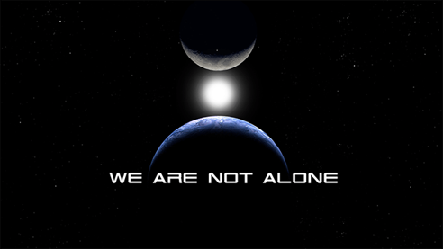

---
title:
author:
date:
output:
  revealjs::revealjs_presentation:
    css: style.css
    incremental: false
    theme: night
    highlight: tango
    transition: none
    center: true
---

# {data-background-color="#0a4f58"}

<h2 style="color: #de3c26;">
Canadian Aquatic Barriers Database
</h2>

<h3>
Supporting fish passage and connectivity conservation in Canada
</h3>

<h5>
Nick Mazany-Wright
</h5>

<h5>
August 23, 2022
</h5>

&nbsp;
&nbsp;
&nbsp;
&nbsp;

<div class="container">
<div class="col">
``` {r, echo=FALSE, out.width="50%", fig.align="left"}

knitr::include_graphics("./img/white-cwf-logo-en.svg")

#AWC3

```
</div>

<div class="col" style="justify-self: end; align-content: end;">
<span style="font-family: Bebas Neue;">Nova Scotia Partner Engagement Symposium</span>
</div>

</div>

# Canadian Aquatic Barriers Database (CABD)

## What is the conservation issue?

What we know:

- Structures like dams, culverts, and dykes block the movement of fish (and other species) and energy/matter
- Barriers to connectivity are extensive across Canada
- Barriers removal needed to restore access to important habitat and ecosystem functions
- Restoration projects are expensive

<center>
{height=200px} {height=200px} {height=200px}
</center>

## What is the conservation issue?

What we don't know:

- How many barriers exist in Canada?
- How much habitat is not accessible?
- How do we identify the most important barriers to maximize benefits?

**<span style="color: #de3c26;">We need comprehensive information to answer these questions</span>**

## Canadian Aquatic Barriers Database (CABD)

<center>
**<span style="color: #de3c26;">Vision:</span>**
</center>

<center>
All Canada's barrier and connectivity information in one place -- easily and openly accessible!
</center>

## Project Background

- CABD = central pillar of tools to support CWF's fish passage program
- Identify and prioritize barriers for restoration
- Inspired The Nature Conservancy's (TNC) work in the northeastern U.S.

<center>

</center>

## A Roadmap for Improving Connectivity

- TNC's Northeast Aquatic Connectivity Assessment Project:
  + A database as a partnership building tool
  + Brings groups together and centralizes efforts
  + Led to significant improvements to fish passage and connectivity

## Penobscot River Restoration (Maine)

- Partnership between government, Indigenous groups, NGOs, and industry
- Two dam removals and one fishway
- 2018: **<span style="color: #de3c26;">2.8 million+</span>** river herring returned

<center>
{height=450px}
</center>

## Importance of Collaboration and Engagement

- Potential uses of CABD extend beyond CWF's needs
  + Freshwater connectivity research
  + Hydrological modelling
  + Infrastructure inventories
- CABD can improve collaboration and partnership
- Launched external engagement to get input on development

<center>
{height=250px}
</center>

## Stakeholder Engagement

- User interviews
  + What type of work could the CABD support?
  + What information would be useful?
  + How would users like to access the data?
- Working Group and Technical Advisory Committee

&nbsp;

<center>
{height=50px} {height=50px} {height=50px} {height=50px} {height=50px}
</center>

<center>
{height=25px} {height=50px} {height=25px}
{height=50px} {height=50px}
</center>

<center>
{height=50px} {height=50px} {height=50px}
{height=50px}
{height=50px}
</center>

## Data Gathering and Sharing

- CABD relies on existing repositories
  + Local in scale
  + Single barrier types
  + No standardization
- CWF provides national coordination **<span style="color: #de3c26;">without</span>** duplicating effort
- Establish **<span style="color: #de3c26;">reciprocal</span>** relationships
  + Share data back to providers

&nbsp;

<center>
{height=200px} {height=200px}
</center>

## What will the CABD be used for?

1. Habitat status assessments and reporting (watershed &rarr; national scales)
2. Informing management and regulatory decisions
3. Restoration planning and prioritization
4. Research and monitoring
5. Education and public outreach

## CABD Components

<div class="container">
<div class="col">
1. Hydrographic networks

<center>
{height=150px}
</center>
</div>

<div class="col">
2. Barrier data

<center>
{height=150px}
</center>
</div>

<div class="col">
3. Web map and tools

<center>
{height=150px}
</center>
</div>

</div>

## Hydrographic networks
- Canada does not have a clean and connected GIS layer representing streams, rivers, and lakes
- National Hydrography Network (NHN) has errors and issues

&nbsp;

<center>
{height=225px} {height=225px} {height=225px}
</center>

## Hydrographic networks

<div class="container">
<div class="col">
- CABD requires clean networks to relate barriers each other and to habitat gains
- CWF leading development of tools to update the NHN &rarr; building on work done by NRCan - **<span style="color: #de3c26;">Common Hydrology Features (CHyF)</span>**
</div>

<div class="col">
<center>

</center>
</div>

</div>

## CHyF v2

- **<span style="color: #de3c26;">Open-source tools</span>**
- Leverages graph theory and web services for improved analytical performance (upstream and downstream traces)
- CWF continuing development:
  + Processing all of Canada
  + Additional attributes (e.g., stream order, flowpath types)
  + Will be available for download or via vector tile service
- Collaboration with NRCan &rarr; our work will be shared to improve the quality of the NHN

<center>
{height=275px}
</center>

## Barrier Data

<div class="container">
<div class="col">
- Standardized data structure through engagement
- Current barrier types:
  + Dams (includes some weirs and dykes for now)
  + Waterfalls
  + **<span style="color: #de3c26;">Fishways</span>** (inherited CANFISHPASS from the Cooke lab at Carleton University)
- Future years:
  + Stream crossings (road, rail, trail)
  + Lateral barriers (dykes/levees, embankments, etc.)
  + Others?
</div>

<div class="col">
<center>

&nbsp;


</center>
</div>

</div>

## Barrier Data Processing

<div class="container">
<div class="col">
Five main steps:

1. Data source compilation
2. De-duplication
3. Spatial attribute mapping
4. Geolocation (including snapping to hydro network)
5. Non-spatial information collection
</div>

<div class="col">
<center>

</center>
</div>

</div>

## Attribute mapping

1. Aggregate attributes from existing spatial sources
2. Identification of non-spatial data sources (search engines)

<center>
**<span style="color: #de3c26;">100+ data sources reviewed to date</span>**
</center>

&nbsp;

<center>
{height=300px} {height=300px}
</center>

## CABD (version 1)

- **<span style="color: #de3c26;">November 2021</span>**: public "sneak peek" release in pilot regions
- **<span style="color: #de3c26;">December 2021</span>**: Alberta release
- **<span style="color: #de3c26;">February 2022</span>**: Atlantic Canada release (NB, NL, NS, PEI)
- **<span style="color: #de3c26;">March 2022</span>**: British Columbia release
- Release remaining data on monthly basis through summer 2022
- Add additional barrier types in future years (e.g., stream crossings)

## Expected Results

&nbsp;

<span style = "font-size: 175%; font-family: Bebas Neue; padding-left: 105px;">Dams</span> <span style = "font-size: 175%; font-family: Bebas Neue; padding-left: 155px;">Waterfalls</span> <span style = "font-size: 175%; font-family: Bebas Neue; padding-left:125px;">Fishways</span>

{height=300px} {height=300px} {height=300} 

<span style = "font-size: 150%; color: #de3c26; padding-left: 65px;">30,000+</span> <span style = "font-size: 150%; color: #de3c26; padding-left: 140px;">10,000+</span> <span style = "font-size: 150%; color: #de3c26; padding-left:170px;">400+</span>

## Demo!

<center>
<a href="https://aquaticbarriers.ca/" data-preview-link>aquaticbarriers.ca</a>
</center>

## Next Steps

- Continue information gathering
  + **<span style="color: #de3c26;">Phase 1:</span>** Compile existing datasets (including stream-crossings)
  + **<span style="color: #de3c26;">Phase 2:</span>** Begin to fill data gaps (with input from citizen scientists!)
- Expand features in the web tool
- Develop documentation site (tutorials, metadata, etc.)
- Develop additional tools

## Additional Tools

**<span style="color: #de3c26;">Standardized barrier assessment protocols</span>**

- Extensive review and synthesis - existing protocols
- Modular approach to maintain flexibility, e.g., <a href="https://streamcontinuity.org/naacc/assessments/aquatic-connectivity-non-tidal" data-preview-link>NAACC protocols</a>
- Series of regional workshops in spring/summer 2022
  
<center>

</center>

## Additional Tools

**<span style="color: #de3c26;">Develop or adapt citizen science apps</span>**

- Partner and public participation to identify and assess barriers:
  1. Information entry portal - allow direct additions to CABD
  2. Mobile app - public can identify and assess barriers
- Collaboration opportunities with existing apps
  + <a href="https://portal.amber.international/" data-preview-link>AMBER (Europe)</a>
  + <a href="https://image.winudf.com/v2/image1/Y29tLndvb2RsYW5kc25vcnRoLmFid2NpX3NjcmVlbl8yXzE1ODkwNzYyODFfMDYy/screen-2.jpg?fakeurl=1&type=.jpg" data-preview-link>Alberta Watercourse Crossing Inventory app</a>
  
## Additional Tools

- Research partnerships
  + Validating functional connectivity indicators
  + Remote sensing/modelling tools (identify barriers, estimate passability)
- Freshwater connectivity toolbox
  + Resources, best practices, success stories

## Watershed Connectivity Remediation Planning framework

<div class="container">
<div class="col">
- Collaborative framework to plan connectivity conservation and restoration - applied in BC and AB
- Adapted from Conservation Standards
- Not intended to be habitat/watershed restoration plan
  + Serves well as a module in such broader plans
- Guide document for connectivity planning in Canada
</div>

<div class="col">
<center>

</center>
</div>

</div>

## Watershed Connectivity Remediation Planning framework

- Key components:
  + Clear geographic and thematic scope
  + Focal (target) species or ecosystem features
  + Current connectivity status estimated for each target
  + SMART goals for gains in connectivity
  + Barrier prioritization to meet goals efficiently
  + Action plan with responsibilities identified and costs estimated

## Watershed Connectivity Remediation Planning framework


- Guides process from desktop prioritization exercises to on-the-ground implementation

# Thank you!

<center>
<h2>Questions?</h2>
</center>
<center>
nickw@cwf-fcf.org
</center>
<center>
*The Canadian Aquatic Barriers Database is a multi-year project that is supported partially by financial contributions from Fisheries and Oceans Canada and the RBC Foundation.*
</center>

